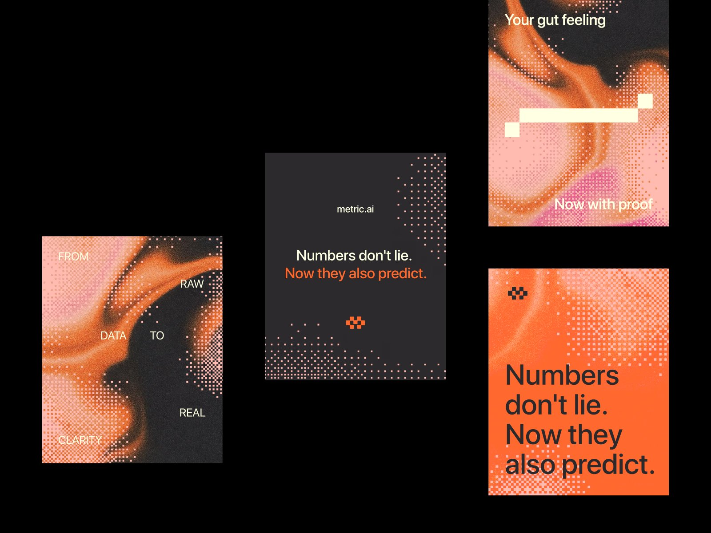

# SpiritAtlas — Visual Reference Breakdown

Implementation companion to [BRAND_GUIDELINES.md](BRAND_GUIDELINES.md).



## What this document establishes

This document analyzes the user-supplied 1600 × 1201 reference image. It separates visible observations from proposed ways to recreate the appearance. The image does not reveal its original font, source files, animation, or rendering technique. Shader and CSS recommendations below are implementation proposals, not claims about the original designer’s process.

The reference contains `metric.ai` branding. Use its color relationships, texture behavior, visual hierarchy, and contrast as inspiration for an original SpiritAtlas identity. Do not reproduce its text, emblem, or complete poster layouts as SpiritAtlas artwork.

**Primary vocabulary:** partial dither; dot-dissolve edges; marbled gradient; square-dot halftone-like texture; selective ordered dithering; warm grain; charcoal negative space; oversized grotesk typography; editorial asymmetry.

**Most useful brief:** “A flowing orange-and-peach marbled field that stays smooth in its center and dissolves into a regular grid of small square dots at selected edges.”

## 1. Read the composition

Coordinates are approximate source-image pixels, measured from the top-left corner. These regions help an agent inspect the attached reference without confusing its black presentation canvas with the individual poster backgrounds.

| Region | Approximate bounds `(left, top) → (right, bottom)` | What to inspect | SpiritAtlas application |
| --- | --- | --- | --- |
| Lower-left poster | `(94, 532) → (501, 1045)` | Orange ribbons curve through dark channels; peach areas break into ordered square patterns; words sit on separate calm patches | Organic background flow and selective dissolve |
| Center poster | `(597, 344) → (1003, 857)` | Large, nearly flat charcoal center; cream headline; orange emphasis; particles mostly at the lower and right edges | Best model for readable landing-page restraint |
| Upper-right poster | `(1099, 0) → (1506, 510)` | Broad peach pool, orange folds, darker upper field; square dots at changing densities; cream geometric interruption | Marbling, changing dot density, and simple graphic contrast |
| Lower-right poster | `(1099, 605) → (1506, 1117)` | Mostly orange field with large charcoal text; peach square texture concentrated near edges | Occasional bold editorial section with inverted color balance |
| Surrounding canvas | Outside the posters | Generous black space and deliberately staggered placement | Translate the breathing room and asymmetry into a coherent page grid |

The collage is a presentation of multiple compositions, not a ready-made website wireframe. Preserve the relationships between quiet and busy areas rather than arranging four floating posters on the landing page.

## 2. Color anatomy

Dominant flat pixels establish these sampled anchors:

| Observed color | Sample | Visual job |
| --- | --- | --- |
| Near-neutral warm charcoal | `#2C2A2D` | Makes the saturated orange and creamy type feel luminous |
| Saturated orange | `#FF682F` | Carries energy and creates the strongest field of emphasis |
| Warm pale peach | `#FFBBB0` | Softens the orange and makes the dissolve visible against charcoal |
| Pale yellow cream | `#FFFFE3` | Warmer than white; used for type and geometric marks |
| Black surround | `#000000` | Separates the displayed poster compositions |

Some textured regions drift toward pink, salmon, dark brown, and burnt orange. These variations can occur inside artwork; they do not all need to become interface tokens. Avoid turning the background into a multicolor rainbow gradient.

## 3. What makes the marbling work

The organic field has direction. Orange bands bend, narrow, widen, and pass between pale pools and dark channels. Highlights follow the bands. There is enough tonal change to suggest folds or liquid reflections, without a literal illustrated object.

Recreate these characteristics:

- A few broad forms establish the composition before fine detail appears.
- Contours bend and stretch asymmetrically; the form should feel cropped from a larger flowing field.
- Dark negative space cuts into the warm regions instead of serving only as a backdrop.
- Peach pools provide softer interior areas beside brighter orange ridges.
- Fine static grain unifies the smooth gradients and pixel texture.

A reasonable procedural approach is domain-warped noise or a displacement field applied to a small set of elongated color bands. An art-directed texture is also valid. Several blurred radial gradients alone are only a starting underpainting: they need directional shaping to become convincing marbling.

## 4. Partial dither and dot-dissolve edges

### What is visible

The “dots” are predominantly **small, axis-aligned squares**. They occupy an orderly grid and form different local densities. They are not a uniformly scattered cloud of circular particles.

Some areas approach a checker pattern; others show isolated squares separated by charcoal. Dense areas merge visually into a pale or orange mass. Smooth color remains beside these patterned areas, which is why **partial** matters.

The treatment alternates between two readings: a color field breaking into islands, and little holes opening in a color field. Both should follow the same larger organic shape. Borders can remain straight at the poster edge while the internal color boundary dissolves.

### What the terms mean here

| Term | Relevant meaning | Common mistaken substitute |
| --- | --- | --- |
| Partial dither | Apply discrete pixel coverage to selected zones while preserving continuous-tone areas | Pixelating the entire screen or every image |
| Dot-dissolve edge | Reduce colored coverage in an organized pattern across a form’s boundary | A generic particle emitter floating away from the image |
| Ordered dither | A repeated threshold arrangement that creates structured density changes | Replacing the threshold with fresh random noise each frame |
| Halftone-like texture | An editorial description of the visual dots | Assuming the source necessarily uses classic circular print halftones |
| Grain | Fine irregular tonal variation across a surface | The larger regular squares; grain and dither are separate layers |

The screenshot is consistent with an ordered square-dot treatment. It is insufficient evidence to identify a particular Bayer matrix or confirm the software that generated it.

### Proposed rendering layers

Draw back to front:

1. Opaque Charcoal or Ink canvas.
2. An art-directed orange/peach marbled color field.
3. A coverage mask defining the field’s continuous body and its dissolving perimeter.
4. A stable square-grid threshold pattern applied only within the chosen dissolve zones.
5. A restrained static grain contribution to the decorative artwork.
6. A separate photographic or physically rendered cocktail scene.
7. Clean DOM typography, ingredient labels, and controls.

The pixel treatment must not be a full-screen postprocessing pass over the cocktail or interface. Separate texture, product, and UI layers so the user can study real drink details without decorative interference.

### Practical implementation recipe

**Static artwork:** use an original precomposed texture containing both smooth marbling and selective square-dot boundaries. CSS handles placement and responsive cropping. A single generic radial mask does not reproduce the ordered square-dot behavior.

**Procedural or animated artwork:** use a small decorative WebGL shader, Canvas renderer, or precomputed threshold mask. Define the grid in CSS-pixel coordinates so the effect remains a consistent apparent size across device pixel ratios. Sample the coverage field once per cell when deciding whether a dot is present.

Recommended starting parameters are design proposals; judge them at the actual rendered size:

| Parameter | Starting point | What to look for |
| --- | --- | --- |
| Grid pitch | 4–7 CSS px in a large hero decoration | Distinct fine squares, still quieter than the cocktail |
| Square size | 45–75% of the cell pitch | Visible dark gaps in sparse regions |
| Dissolve band width | About 8–18% of the local decorative form’s width | A readable transition between solid color and isolated dots |
| Pattern | Stable 4×4 or 8×8 ordered thresholds | Regular structure without large repeating tiles becoming obvious |
| Grain | Low-amplitude static luminance variation, around 1–3% | Surface warmth without muddy copy or glass |
| Texture coverage | Selected outer contours and corners | Large smooth regions and clean text zones remain |
| Motion | Optional slow deformation; stable grid and seed | Flow without shimmer, crawling pixels, or visual distraction |

Increase density by enabling more grid cells or opening fewer holes. Do not merely lower the entire layer’s opacity: the defining detail is a change in local coverage.

Conceptual pseudocode for one decorative layer:

```text
cssPosition = fragmentPositionInDevicePixels / devicePixelRatio
cell = floor(cssPosition / pitch)
cellCenter = (cell + 0.5) * pitch

# Smooth art-directed coverage: 0 outside the ribbon, 1 inside.
a = coverageAt(cssPosition)
aCell = coverageAt(cellCenter)

# One stable threshold per cell; Bayer4 returns integers 0 through 15.
threshold = (Bayer4[cell.y mod 4][cell.x mod 4] + 0.5) / 16
cellEnabled = step(threshold, aCell)

# Smaller-than-cell squares leave gaps at the sparse outer edge.
# They grow toward full cells as coverage approaches the solid body.
squareWidth = mix(0.55, 1.0, smoothstep(0.20, 0.80, aCell))
local = abs(fract(cssPosition / pitch) - 0.5)
squareMask = antialiasedSquare(local, squareWidth / 2)
dotCoverage = cellEnabled * squareMask

# Preserve a continuous interior and artist-selected untreated regions.
edgeWeight = 1 - smoothstep(0.55, 0.90, a)
mixWeight = edgeWeight * artDirectedDitherMask(cssPosition)
alpha = mix(a, dotCoverage, mixWeight)

color = marbleAt(cssPosition) + subtleStaticGrain(cssPosition)
compositeDecorativeColorOverCharcoal(color, alpha)
```

Example 4×4 ordered threshold matrix:

```text
 0   8   2  10
12   4  14   6
 3  11   1   9
15   7  13   5
```

This is a construction method to refine, not a claim of pixel-identical reconstruction. Use a stable coordinate origin, filter the square edges lightly, and keep the source grid from swimming during animation. When using premultiplied-alpha blending, multiply the output RGB by the final alpha to avoid dark or bright fringes; keep the chosen blending convention consistent.

Avoid adding a WebGL dependency solely for a static decorative image. If a 3D engine is already present, keep the decoration isolated from the product-rendering pipeline and its color management.

## 5. Typography and spacing in the source

The type appears to be a clean contemporary grotesk sans-serif. It is mostly regular or medium in visual weight, with generous scale and controlled line breaks. The image alone does not identify the family reliably.

The center composition uses a cream statement with one orange line. The lower-right composition uses large charcoal text on orange. This is an emphasis system, not a requirement to highlight every heading.

Text remains geometrically crisp beside granular artwork. Transfer that distinction to SpiritAtlas with Instrument Sans for display and copy. Use IBM Plex Mono sparingly for labels such as bar indices and coordinates; mono is an added SpiritAtlas choice, not a visible requirement of the reference.

The layouts rely on empty areas, not borders around everything. Build a consistent page grid, generous margins, and clear alignment. Keep visible imagery near some edges and let other edges breathe. Use the restrained center poster as the default model for functional interfaces.

## 6. How to adapt the reference to SpiritAtlas

| Source principle | SpiritAtlas interpretation | Guardrail |
| --- | --- | --- |
| Fluid marbling | Abstract warmth, orange peel, liquid movement, evening atmosphere | Preserve each real cocktail’s actual appearance |
| Dissolving squares | The visual transition from a complete drink to inspectable detail | Use around the stage or during a reveal; keep labels sharp |
| Charcoal negative space | A calm stage for glass, ice, and floating components | Do not crush dark details in glass or the map |
| Pale cream type | An inviting editorial voice | Protect contrast over image regions |
| Orange emphasis | The next action, the active bar, a short phrase | Avoid making every control and heading equally bright |
| Oversized type | A memorable promise: “Singapore’s cocktails. Inside out.” | Allow responsive line breaks rather than shrinking the headline excessively |
| Pixel emblem | Inspiration for a possible future original graphic vocabulary | Do not copy the source emblem |

## 7. Implementation acceptance criteria

- [ ] At least one visible decorative region has both a smooth marbled interior and a square-dot dissolve boundary.
- [ ] Marbling has directional folds or ribbons, peach pools, and dark channels; it is more specific than an unfocused orange glow.
- [ ] The dots are small squares on a stable grid, with noticeably different local densities.
- [ ] Dither is concentrated along selected contours or corners, leaving substantial calm areas.
- [ ] Text, buttons, map labels, and ingredient annotations remain crisp and unobscured.
- [ ] The drink’s glass rim, garnish, ice, and liquid color remain faithful to its photographic reference.
- [ ] The palette uses the sampled anchors; new interface colors have a clear role.
- [ ] Orange buttons use dark text. All required text and control states meet their contrast requirements.
- [ ] At 1440px and 390px viewport widths, the image crops remain deliberate and the texture never becomes a full-screen wall of noise.
- [ ] At different device pixel ratios, the decorative squares keep a consistent apparent size.
- [ ] Reduced-motion mode removes ambient animation while preserving interaction and information.
- [ ] No source-company wordmark, wording, emblem, or complete poster layout appears in the SpiritAtlas product.

## 8. Short brief for a coding agent

> Read `BRAND_GUIDELINES.md` and `VISUAL_REFERENCE.md`, then visually inspect `docs/references/spiritatlas-style-reference.png`. Build SpiritAtlas around warm charcoal, saturated orange, peach, and cream, with Instrument Sans and restrained IBM Plex Mono labels. The signature artwork is a flowing marbled orange-and-peach field with partial dither: selected edges dissolve into small square dots on a regular grid while the interior stays smooth. Keep photographic cocktails, typography, controls, and ingredient labels on separate crisp layers. Use generous editorial spacing and make “Singapore’s cocktails. Inside out.” the central landing-page message. Implement the visual foundation first, then review the result against the reference and acceptance criteria before extending it across the atlas and comparison views. Treat the supplied image as visual inspiration and create original SpiritAtlas artwork.
